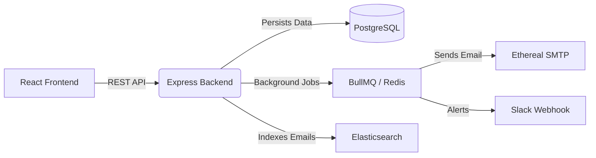

# OutBox Email Scheduler

OutBox is a robust, production-ready email scheduling application built to handle bulk email scheduling with built-in rate limiting, background job processing, and full-text search capabilities.

## 🚀 Features

- **Google OAuth Authentication**: Secure login using Passport.js and JWT.
- **Bulk Email Scheduling**: Schedule single or bulk emails via UI or CSV upload.
- **Background Processing**: Reliable job processing using **BullMQ** and **Redis**.
- **Rate Limiting**: Distributed Redis-backed rate limiter enforcing strict limits (global and per-sender).
- **Full-Text Search**: Instant email search using **Elasticsearch**.
- **SMTP Integration**: Auto-provisioned **Ethereal** test email accounts for previewing sent emails.
- **Slack Notifications**: Real-time webhook alerts when users hit their rate limits.
- **Modern Dashboard**: Beautiful UI built with **React**, **Vite**, and **Tailwind CSS**.

---

## 🏗️ Architecture



### Tech Stack
- **Frontend**: React, Vite, TypeScript, Tailwind CSS, Lucide Icons, Axios.
- **Backend**: Node.js, Express, TypeScript, Passport.js, Prisma ORM.
- **Infrastructure**: PostgreSQL, Redis, Elasticsearch, Docker Compose.

---

## ⚙️ Getting Started

### 1. Prerequisites
Ensure you have the following installed:
- [Node.js](https://nodejs.org/) (v18+)
- [Docker & Docker Compose](https://www.docker.com/)

### 2. Infrastructure Setup
Start the required background services (Postgres, Redis, Elasticsearch) using Docker:
```bash
docker-compose up -d
```

### 3. Backend Setup
Navigate to the `backend` directory and install dependencies:
```bash
cd backend
npm install
```

Configure your environment variables by creating a `.env` file (copy from `.env.example` if available) and adding your Google OAuth credentials.

Initialize the database schema:
```bash
npx prisma migrate dev --name init
```

Start the backend server (starts both the API and the BullMQ worker):
```bash
npm run dev
```

### 4. Frontend Setup
Navigate to the `frontend` directory and install dependencies:
```bash
cd frontend
npm install
```

Start the frontend development server:
```bash
npm run dev
```

Visit `http://localhost:5173` to view the application!

---

## 📊 BullMQ Dashboard
You can monitor the background queues, failed jobs, and active workers by visiting the built-in Bull Board at:
**[http://localhost:3001/admin/queues](http://localhost:3001/admin/queues)**

## 🛡️ Rate Limiting & Resilience
OutBox uses Redis to maintain atomic counters for rate limiting. 
- **Per-Sender Limit**: (e.g., 50 emails/hour).
- **Global Limit**: (e.g., 200 emails/hour).

When a limit is reached, BullMQ natively pauses the specific email job and reschedules it into the future (`job.moveToDelayed`), ensuring no emails are lost and third-party SMTP limits are strictly respected.
