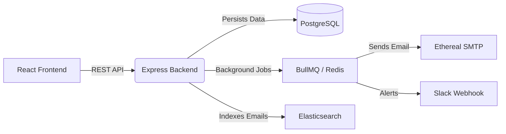

# OutBox Email Scheduler

OutBox is a robust, production-ready email scheduling application built to handle bulk email scheduling with built-in rate limiting, background job processing, and full-text search capabilities.

## 🚀 Architecture Overview



### Tech Stack
- **Frontend**: React, Vite, TypeScript, Tailwind CSS, Lucide Icons, Axios.
- **Backend**: Node.js, Express, TypeScript, Passport.js, Prisma ORM.
- **Infrastructure**: PostgreSQL, Redis, Elasticsearch, Docker Compose.

---

## ⚙️ Prerequisites & Setup

### 1. Prerequisites
Ensure you have the following installed:
- Node.js (v18+)
- Docker & Docker Compose

### 2. Infrastructure Setup (Docker, PostgreSQL, Redis, Elasticsearch)
Start the required background services (Postgres, Redis, Elasticsearch) using Docker:
```bash
docker-compose up -d
```

### 3. Backend Setup
Navigate to the `backend` directory and install dependencies:
```bash
cd backend
npm install
```

Initialize the database schema:
```bash
npx prisma migrate dev --name init
```

Start the backend server (starts both the API and the BullMQ worker):
```bash
npm run dev
```

### 4. Frontend Setup
Navigate to the `frontend` directory and install dependencies:
```bash
cd frontend
npm install
```

Start the frontend development server:
```bash
npm run dev
```
Visit `http://localhost:5173` to view the application!

---

## 🔧 Environment Variables

An `.env.example` file is provided in the root. 

- **ETHEREAL_USER / ETHEREAL_PASS**: Ethereal setup is auto-generated on first run.
- **GOOGLE_CLIENT_ID / SECRET**: Set up Google OAuth credentials in Google Cloud Console.
- **SLACK_CLIENT_ID / SECRET**: Set up Slack OAuth credentials for notifications.

---

## 💡 Explanations of Key Mechanisms

### Rate Limiting Explanation
OutBox enforces both global (`MAX_EMAILS_PER_HOUR`) and per-sender (`MAX_EMAILS_PER_HOUR_PER_SENDER`) limits. Instead of relying on vulnerable client-side checks, rate limits are managed atomically via a **Redis Lua script**. If a limit is hit, the job calculates the remaining time in the current hour window and schedules itself to run exactly when the limit resets.

### Concurrency Explanation
Workers operate concurrently up to `WORKER_CONCURRENCY`. However, a strict `DELAY_BETWEEN_EMAILS_MS` must be enforced across all workers. This is achieved via a **Redis-backed atomic spacer** which reserves the next available global timestamp slot, allowing true parallel processing without violating minimum send delays.

### Restart Persistence Explanation
Scheduled jobs are persisted in **PostgreSQL**. On backend startup, a recovery function (`requeuePendingEmails`) fetches all pending jobs and re-queues them into **BullMQ**. This ensures that jobs delayed by server downtime are immediately sent, and future emails are never lost across restarts. No OS cron is used; BullMQ's native delayed queues handle precise scheduling.

### Idempotency Explanation
Every scheduled email generates a deterministic `idempotencyKey` based on the user ID, sender, recipient, scheduled time, and batch ID. This prevents the API from enqueuing duplicate logical emails. Application-level idempotency prevents duplicate dispatching; however, exact-once SMTP delivery is inherently unachievable due to network crash windows post-SMTP accept.

### Elasticsearch Explanation
Emails are pushed to **Elasticsearch** immediately upon creation and updated upon sending. This provides fuzzy, high-performance, full-text search isolated strictly by the user's ID. PostgreSQL remains the single source of truth; Elasticsearch acts strictly as the search index.

### BullMQ Worker Setup
The workers initialize securely connected to the same Redis instance. You can monitor the background queues by visiting the built-in Bull Board at **[http://localhost:3001/admin/queues](http://localhost:3001/admin/queues)**.

---

## 📑 API Reference

- `POST /api/auth/google`: Initiates Google OAuth.
- `GET /api/slack/connect`: Initiates Slack OAuth.
- `POST /api/emails/schedule`: Schedules a single email.
- `POST /api/emails/schedule-bulk`: Schedules bulk emails from CSV/text.
- `GET /api/search`: Fuzzy searches emails using Elasticsearch.

---

## ✅ Features Implemented & Assumptions
- **Features Implemented**: Full scheduling UI, distributed rate limiting, robust idempotency, Slack notifications, search functionality, resilient restart recovery.
- **Assumptions**: We assume Slack Webhook URLs shouldn't trigger job failures if Slack APIs temporarily fail; we strictly isolate these errors from the email delivery pipeline.
- **Trade-offs**: Used Ethereal instead of production SMTP providers to avoid SPAM costs. Opted for Redis Lua scripts instead of complex database locking for higher rate limiting throughput.
- **Limitations**: Exact-once SMTP delivery guarantee remains impossible due to standard SMTP protocol constraints; application guarantees idempotency *before* handoff.
